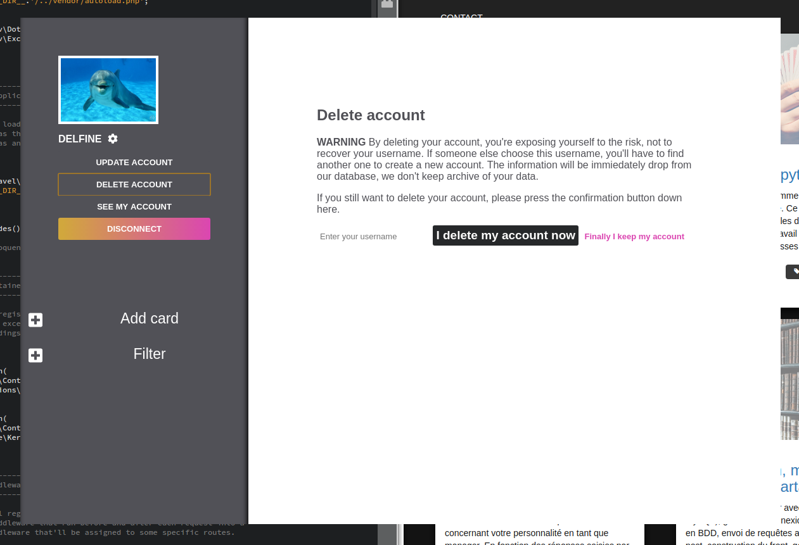

# hackathonDFS
Team project - TodoMe.com - my shared todolists
Web application built on electron and Lumen frmework with routes system implementation, and AJAX request.
Database : MySQL. connected in the env file of Lumen

<!DOCTYPE html>
<h1>FIRST STEP</h1>

  

    <h3>Login</h3>
    
The login page is the home page of this app. You need to be logged to access the dashboard.

    
  

  

    <h3>Or signin</h3>
    
Create your account by registering in our database. Easy !

    
  

<h1>MANAGE YOUR PROFILE</h1>

  

    <h3>Update</h3>
    
You can update your datas by rewritting them and submit. Your dashboard sidebar will instantly refresh ! The settings also allow user to view the profile

    
  

  

    <h3>Delete</h3>
    
You can delete your account. It's easy but not too much, you still have to input your username, and you can read the warning message.

    
  

<h1>MANAGE YOUR CARDS</h1>

  

    <h3>Add a new card</h3>
    
The dashboard is designed to make the card creation easy. Drop down the creation card form, choose your settings, click ok. The card appear in the dashboard.

    
  

  

    <h3>Share</h3>
    
To share your card with your bro, go in the card menu and click on share. The seach tool will drop down in the sidebar. You can find your friend by entering their username (unique on the DB). Add or remove your friend on the card, their avatar will appear or disappear from your card. Then, Your friend can see the card.

    
    
    
  

  

    <h3>Manage your todolist !</h3>
    
And now we're talking. Add tasks. As many as you want. Mark it in "done" simply by clicking on the task. Drop the task with the little trash icon. And always check your progress bar on the bottom of your card (it updates by itself at each action on the tasks) !

    
  

  

    <h3>Search you card with the filter</h3>
    
You only want to see the omg-I'm-so-late-cards ? Use the filter. Want to see the red-category-cards ? Use the filter. The filter exist only to get your experience better. When you'll have 125 302 298 cards, it will helps you very much !

    
  

<html>
